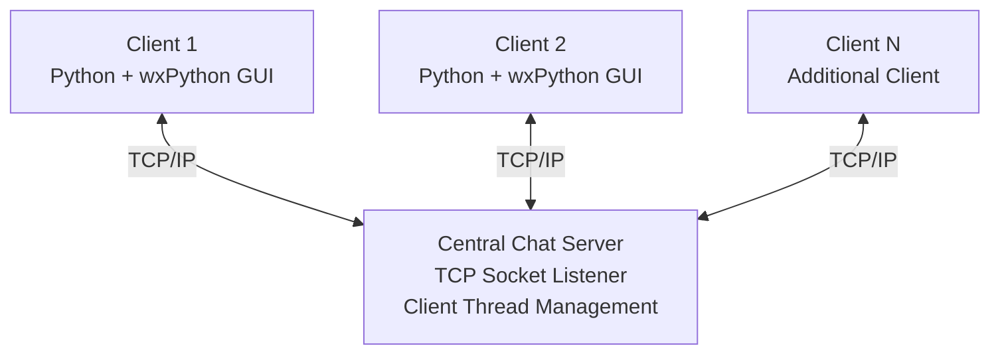
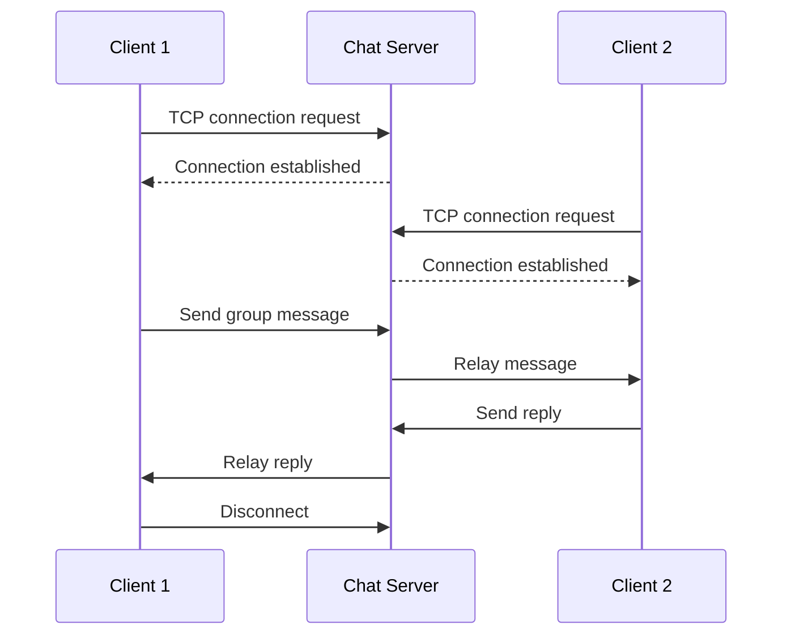

# TCP/IP Client-Server Architecture

## Secure Multi-Client Chat Application

This project uses a centralized client-server architecture built with Python socket programming and TCP/IP.

## Network Architecture

The diagram illustrates the architecture's ability to support multiple clients. The documented project demonstration shows two clients connected to the chat server.

## Connection Establishment

1. The server creates a TCP socket.
2. The server binds to an IP address and port.
3. The server listens for incoming connections.
4. A client creates a socket and initiates a connection.
5. The server accepts the connection.
6. Threads handle concurrent client communication.
7. Messages are routed through the central server.
8. Clients disconnect when the session ends.

## Message Communication Flow

## Networking Concepts

- TCP/IP socket programming
- IPv4 addressing and port binding
- Client-server communication
- Multithreading
- Concurrent client sessions
- Message routing
- File transfer
- Connection establishment and termination

## Implementation Notes

The application uses a central server to coordinate communication between clients.

The project documentation demonstrates group messaging, nickname assignment, file transfers up to 1 MB, and client disconnection.

The specific encryption implementation will be documented once the original source code is available for verification.
